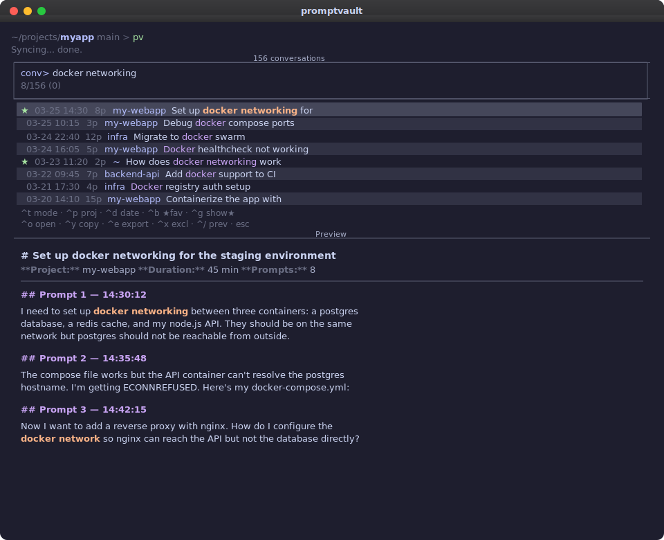
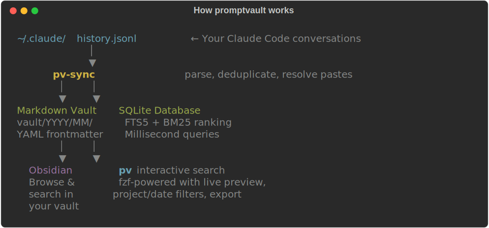

<p align="center">
  
</p>

<p align="center">
  <a href="https://pypi.org/project/promptvault/"></a>
  <a href="https://github.com/reidemeister94/promptvault/actions/workflows/ci.yml"></a>
  <a href="LICENSE"></a>
  <a href="https://github.com/reidemeister94/promptvault/stargazers"></a>
  <a href="https://github.com/reidemeister94/promptvault/issues"></a>
  
  
</p>

<p align="center">
  <b>Your Claude Code conversations, searchable forever.</b>
</p>

<p align="center">
  <a href="#the-problem">Problem</a> &middot;
  <a href="#how-it-works">How It Works</a> &middot;
  <a href="#quick-start">Quick Start</a> &middot;
  <a href="#commands">Commands</a> &middot;
  <a href="#real-time-capture">Real-Time Capture</a> &middot;
  <a href="#architecture">Architecture</a>
</p>

---

## The Problem

Claude Code stores conversation history in `~/.claude/history.jsonl` — a raw, append-only JSONL file.

- **Not searchable.** Finding a prompt means grepping through thousands of JSON lines.
- **Not browsable.** No conversation grouping, timestamps, or context.
- **Not persistent.** Claude Code compacts and deletes old session files without warning.
- **Not shareable.** Raw JSONL doesn't open in Obsidian or publish on GitHub.

**promptvault** turns that history into a searchable markdown library + SQLite database. Browse in Obsidian or search from the terminal with fzf.

Zero dependencies. Pure stdlib.

<p align="center">
  
</p>

---

## How It Works

<p align="center">
  
</p>

`promptvault-sync` reads your Claude Code history, groups prompts by conversation, and generates:

1. **Markdown vault** — One `.md` per conversation, organized by `YYYY/MM/`, with YAML frontmatter. Drop into Obsidian to browse your prompt history.

2. **SQLite database** — FTS5 full-text search with BM25 ranking. Searches thousands of prompts in milliseconds.

The sync is **idempotent** — always rebuilds from `history.jsonl`, so it's impossible to reach a bad state.

**Bonus features:**
- `[Pasted text #N +M lines]` placeholders are resolved with actual pasted content
- Consecutive duplicate prompts within a session are deduplicated
- Slash commands (`/help`, `/compact`, etc.) are filtered out
- Conversation titles from Claude Code's `sessions-index.json` are used when available
- Trailing whitespace and excessive blank lines are cleaned up

---

## Quick Start

### Prerequisites

- **Python 3.10+**
- **[fzf](https://github.com/junegunn/fzf)** — for interactive search (optional, falls back to plain text)

#### Install fzf

| Platform | Command |
|----------|---------|
| **macOS** | `brew install fzf` |
| **Linux (apt)** | `sudo apt install fzf` |
| **Linux (dnf)** | `sudo dnf install fzf` |
| **Windows (WSL)** | `sudo apt install fzf` |
| **Windows (scoop)** | `scoop install fzf` |
| **Windows (choco)** | `choco install fzf` |
| **Windows (winget)** | `winget install junegunn.fzf` |

### Install

```bash
pip install promptvault
```

Or install from source:

```bash
git clone https://github.com/reidemeister94/promptvault.git
cd promptvault
pip install -e .
```

> **Windows (without WSL):** If `python` is not on your PATH, install from [python.org](https://www.python.org/downloads/) or via `winget install Python.Python.3.12`.

### Sync your history

```bash
promptvault-sync
```

```
Reading history from ~/.claude/history.jsonl...
Found 899 conversations, 2890 prompts
Loaded 132 session titles from Claude Code
Generating markdown vault...
Building SQLite database...

Done! Vault: ~/.claude/prompt-library/vault
Database: ~/.claude/prompt-library/prompts.db
```

> **Windows note:** `~` resolves to `%USERPROFILE%` (e.g. `C:\Users\YourName`). Claude Code stores history in `%USERPROFILE%\.claude\history.jsonl` and promptvault outputs to `%USERPROFILE%\.claude\prompt-library\`.

### Search

```bash
pv                        # interactive browser (all conversations)
pv search "migration"     # search + interactive results
```

> **Tip:** `pv` is a short alias for `promptvault`. Both work. Same for `pv-sync` / `promptvault-sync`.

---

## Commands

All commands launch an **interactive fzf interface** by default (when fzf is installed and stdout is a tty). Use `--no-fzf` for plain text output.

The interactive mode shows:
- **Left panel** — conversations with date, prompt count, project, and title
- **Right panel** — live preview of prompts in the selected conversation, with search terms highlighted
- **Controls** — `Up/Down` navigate, `Enter` opens in `$EDITOR`, `Ctrl-Y` copies to clipboard, `Esc` quits, type to search

### `promptvault`

Browse all conversations interactively. Type to filter.

### `promptvault search "query"`

Full-text search via SQLite FTS5, ranked by relevance.

```bash
promptvault search "database migration"
promptvault search "auth middleware"
promptvault search "pytest fixtures" --no-fzf   # plain text output
```

### `promptvault recent [N]`

Show the most recent conversations. Defaults to 20.

```bash
promptvault recent       # last 20 conversations
promptvault recent 50    # last 50
```

### `promptvault list`

List conversations. Filter by date or project.

```bash
promptvault list                          # all conversations
promptvault list --date 2026-03-25        # today's conversations
promptvault list --project auth       # filter by project name
promptvault list --date 2026-03-25 -n 5   # today's top 5
```

### `promptvault stats`

Vault overview — conversation count, prompt count, top projects, date range.

```bash
promptvault stats
```

### `promptvault-sync`

Rebuild the vault and database from `~/.claude/history.jsonl`. Idempotent.

```bash
promptvault-sync
```

---

## Markdown Vault

Each conversation becomes an Obsidian-compatible markdown file:

```markdown
---
session_id: c792e74f-c1bf-4bd1-af69-795b50f355b4
project: /Users/you/my-project
started: 2026-03-25T18:51:48
ended: 2026-03-25T19:20:05
prompt_count: 10
tags:
  - claude-code
  - promptvault
---

# Refactor the user authentication API endpoint

**Project:** `my-project`
**Duration:** 2026-03-25 18:51 - 19:20 (28 min)
**Prompts:** 10

---

## Prompt 1 — 18:51:48

refactor the user authentication API to use the new service layer...

## Prompt 2 — 18:55:12

can you add proper error handling for the database connection?
```

### Vault Structure

```
~/.claude/prompt-library/vault/
├── _index.md                    # Global index with links to all conversations
├── 2026/
│   ├── 01/
│   │   ├── 2026-01-19__b300fdf4__first-prompt-slug.md
│   │   └── ...
│   ├── 02/
│   │   └── ...
│   └── 03/
│       ├── 2026-03-25__c792e74f__refactor-user-auth.md
│       └── ...
```

Open `~/.claude/prompt-library/vault/` as an Obsidian vault. The Calendar plugin works well for chronological browsing.

---

## Real-Time Capture

A Claude Code hook captures every prompt the moment you send it — no sync needed.

### Setup

Add a `UserPromptSubmit` hook to `~/.claude/hooks.json`:

**macOS / Linux / WSL:**

```json
{
  "hooks": {
    "UserPromptSubmit": [{
      "hooks": [{
        "type": "command",
        "command": "python3 /path/to/promptvault/promptvault/hook.py",
        "timeout": 5000
      }]
    }]
  }
}
```

**Windows (without WSL):**

```json
{
  "hooks": {
    "UserPromptSubmit": [{
      "hooks": [{
        "type": "command",
        "command": "python C:\\path\\to\\promptvault\\promptvault\\hook.py",
        "timeout": 5000
      }]
    }]
  }
}
```

The hook is:
- **Fast** — <50ms, pure JSON append
- **Silent** — no stdout, doesn't inject into Claude's context
- **Safe** — errors are swallowed, never blocks Claude Code

Captured prompts go to `~/.claude/prompt-library/capture.jsonl` — a real-time log queryable between syncs.

---

## Architecture

```
promptvault/
├── promptvault/
│   ├── __init__.py   # Package metadata
│   ├── sync.py       # Reads history.jsonl → generates vault/ + prompts.db
│   ├── search.py     # Interactive fzf search + plain text CLI
│   └── hook.py       # UserPromptSubmit hook (real-time capture)
├── tests/
│   ├── conftest.py          # Shared fixtures (synthetic history.jsonl)
│   ├── test_sync.py         # Sync module unit tests
│   ├── test_sync_coverage.py  # Coverage: format_duration, _clean_for_title, make_display_name, generate_markdown, main
│   ├── test_search.py       # Search module unit tests
│   ├── test_search_coverage.py # Coverage: _auto_sync_if_stale, cmd_list, cmd_recent, cmd_search, main dispatch
│   ├── test_hook.py         # Hook module tests
│   └── test_e2e.py          # End-to-end: builds DB from scratch, tests every path
├── docs/
│   ├── images/          # SVG assets (social preview, terminal demo, how-it-works)
│   ├── plans/           # Research and implementation plans
│   └── chronicles/      # Development session write-ups
├── pyproject.toml
├── Makefile
├── .pre-commit-config.yaml
├── requirements.in
├── requirements-dev.in
├── VERSION
├── LICENSE
└── README.md
```

### Design Decisions

| Decision | Why |
|----------|-----|
| **`history.jsonl` as source of truth** | Authoritative, always complete, maintained by Claude Code. Session JSONL files are too complex for prompt-only extraction. |
| **Full rebuild on every sync** | Simpler than incremental — no state bugs, no dedup logic. ~1s for 3000 prompts. |
| **Date-based directory structure** | Flat directories are unusable at 900+ files. Project-based grouping breaks when prompts span projects. Date-based maps to Obsidian's Calendar plugin. |
| **SQLite FTS5 for search** | Built into Python stdlib. BM25 ranking included. No external engine needed. |
| **fzf for interactive UX** | Industry-standard fuzzy finder. Exact substring matching, live preview, keyboard navigation. Falls back to plain text when unavailable. |
| **Zero Python dependencies** | Python stdlib has everything: `json`, `sqlite3`, `pathlib`, `argparse`. fzf is a system tool, not a Python package. |
| **Hook as convenience, not requirement** | The sync script is the authoritative data path. If the hook fails, nothing is lost. |
| **fzf search via DB reload** | Typing in fzf queries SQLite FTS on each keystroke (`--disabled` + `change:reload`). Searches all prompts across all conversations, not just titles. Prefix matching via `*` wildcard. |
| **Session titles from `sessions-index.json`** | Claude Code auto-generates conversation summaries. Used when available, with first-prompt fallback. |

### Environment Variables

| Variable | Default | Description |
|----------|---------|-------------|
| `PROMPTVAULT_HISTORY` | `~/.claude/history.jsonl` | Claude Code history file |
| `PROMPTVAULT_OUTPUT` | `~/.claude/prompt-library` | Output directory for vault + DB |
| `PROMPTVAULT_DB` | `~/.claude/prompt-library/prompts.db` | SQLite database |
| `PROMPTVAULT_VAULT` | `~/.claude/prompt-library/vault` | Markdown vault directory |
| `PROMPTVAULT_PROJECTS` | `~/.claude/projects` | Claude Code projects dir (for session titles) |
| `PROMPTVAULT_CAPTURE_LOG` | `~/.claude/prompt-library/capture.jsonl` | Real-time capture log |

> On Windows (without WSL), `~` maps to `%USERPROFILE%`. Override paths with these environment variables if your Claude Code config lives elsewhere.

---

## Development

```bash
git clone https://github.com/reidemeister94/promptvault.git
cd promptvault
pip install -e .
make setup-dev-env   # Install pre-commit hooks

make test            # Run tests
make lint            # Lint with ruff
make format          # Format with ruff
```

> **Windows (without WSL):** `make` is not available by default. Run directly: `pip install -e ".[dev]"`, `pytest`, `ruff check .`, `ruff format .`.

187 tests covering sync, search, hook, and end-to-end. All use synthetic data — no dependency on real `history.jsonl`.

---

## Roadmap

- [ ] **Incremental sync** — Only process new prompts since last sync
- [ ] **Claude response capture** — Include Claude's responses (from session JSONL files)
- [ ] **Obsidian plugin** — Native sidebar, auto-sync, graph view integration
- [ ] **TUI browser** — Interactive terminal UI with `textual`
- [ ] **Export formats** — HTML, PDF, JSON export
- [ ] **Multi-tool support** — Parse history from Cursor, Copilot, Windsurf, etc.

---

## Contributing

Contributions welcome. Open an issue to discuss before submitting a PR.

**Ideas:**
- New search features (date ranges, regex)
- Better conversation naming heuristics
- Support for additional AI coding tools
- Performance optimizations for large histories

---

## License

MIT

---

<p align="center">
  <a href="https://github.com/reidemeister94/promptvault/stargazers"></a>
</p>

<p align="center">
  <a href="https://github.com/reidemeister94/promptvault/issues">Report an issue</a> &middot; <a href="#contributing">Contribute</a>
</p>
